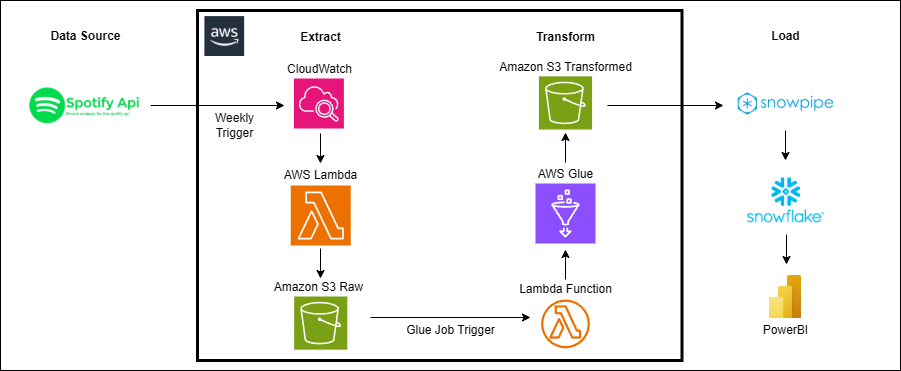

## Spotify-ETL-Pipeline

### 📌 Project Overview

This data engineering project focuses on extracting, ingesting, transforming, and visualizing weekly updates from the **Spotify Top Global Songs** playlist using a cloud-native ETL pipeline. The workflow simulates a modern data pipeline using **AWS services (CloudWatch, Lambda, S3, Glue)**, **Snowflake**, and **Power BI** to enable real-time trend tracking and analytics. The pipeline is designed to automatically fetch the latest top songs data weekly, transform it into structured formats, and deliver insights through a Power BI dashboard.

---

### 🛠️ Tools & Technologies Used

 
 

 
 

---

### 📊 Architecture

---

### 📑 Data Source

The project uses the [Spotify Web API](https://developer.spotify.com/documentation/web-api/) to access the **Top Songs Global** playlist, refreshed weekly. The data includes:

- **Album Info**: Album name, release date, total tracks.
- **Artist Details**: Artist name, ID, genres.
- **Song Metadata**: Song name, duration, popularity, etc.
- **Timestamps**: Ingestion date for weekly tracking.

---

### 🚀 Engineering Process

1. **Data Extraction**:
- **AWS Lambda** is scheduled via **CloudWatch** to run weekly.
- The Lambda function fetches Top Songs Global data from the Spotify API.
- Raw JSON data is saved into the **S3 RAW zone**, partitioned by date.

2. **Data Transformation**:
- **AWS Glue** job is triggered by the Lambda function on an S3 event when new raw data is added.
- PySpark processes raw S3 data into structured datasets: `albums`, `artists`, `songs`.
- Transformed data is stored in the **S3 Transformed zone**.

3. **Data Loading**:
- **Snowflake Database** is created to serve as the analytics warehouse.
- A **Storage Integration (`s3_init`)** securely connects Snowflake to the S3 Transformed zone via an external stage.
- **Snowpipe** is configured with `AUTO_INGEST` to load new data into `albums`, `artists`, and `songs` tables as soon as it's available.

4. **Data Serving**:
- **Power BI** connects directly to Snowflake.
- Interactive dashboards track weekly song popularity and artist trends.

---

### 🎵 Top Songs Global Analytics

<!-- Replace with your actual Power BI dashboard screenshot path -->

---

